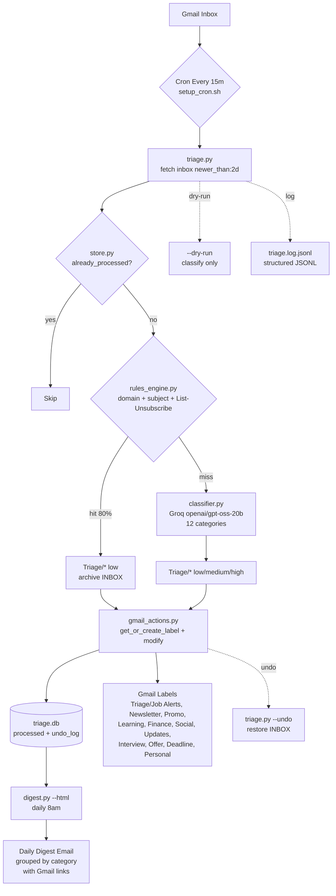

# gmailsage

Personal inbox triage: rules-first, LLM fallback (Groq), auto-label + archive job-alert spam, daily digest for what matters.

## Architecture



**Flow:** Every 15m `triage.py` pulls `in:inbox newer_than:2d` (max 50, env `TRIAGE_QUERY`/`TRIAGE_MAX_RESULTS`). `rules_engine.py` checks `sender_domains.json` (22 job_alert + 16 newsletter domains) + `List-Unsubscribe` heuristic — 80% hit, no LLM cost, `low` → auto-archived (remove `INBOX`, reversible). Miss → `classifier.py` (Groq, cached, 12 categories) decides `high/medium/low`. `gmail_actions.py` creates `Triage/*` labels once (`labelShow`) and archives only `low`. `store.py` dedupes via `triage.db` (subject/domain + `undo_log`), logs to `triage.log.jsonl`. `digest.py` groups `high` last 24h (`DIGEST_HOURS`) into HTML/text with direct `mail.google.com/#inbox/<id>` links.

| Category | Priority | Action | Example |
|---|---|---|---|
| interview/offer/deadline/personal | high | keep INBOX | interview invite, GitHub token expiry |
| updates/other | medium | keep INBOX | security alert, personal 1:1 |
| job_alert/newsletter/promo/learning/finance/social | low | archive + `Triage/*` | hirist.tech jobs, NPTEL, Groww digest, Skool |

## Setup

1. **Google Cloud OAuth**
   - console.cloud.google.com → new project → enable "Gmail API"
   - OAuth consent screen → External → add your own email as a test user
   - Credentials → Create OAuth client ID → Desktop app → download JSON
   - Save it as `credentials.json` in this folder

2. **Install deps**
   ```
   pip install -r requirements.txt
   ```

3. **Groq API key** — free at console.groq.com → copy `.env.example` to `.env`, fill in `GROQ_API_KEY`.

4. **First auth + sanity check**
   ```
   python gmail_auth.py
   ```
   Opens a browser, you approve, creates `token.json` (auto-refreshes after).

## Usage

**Always dry-run first** to see what it *would* do, before it touches labels:
```
python triage.py --dry-run
```

Check the output. If `job_alert` classifications look right, tune `rules/sender_domains.json`
with any senders that slipped to the LLM tier (cheaper + more predictable than the LLM).

Once you trust it:
```
python triage.py
```

Set up a daily cron (or AWS EventBridge → Lambda, since that's your stack) to run
`triage.py` every few hours and `digest.py` once a morning.

## Safety notes

- Nothing is ever deleted. "Archiving" = removing the `INBOX` label — mail still exists
  in All Mail, fully searchable, fully reversible.
- Starts on `gmail.readonly` scope; `triage.py` (non-dry-run) needs `gmail.modify` —
  re-auth will prompt for the extra permission the first time.
- `triage.db` (SQLite) tracks processed message IDs so re-runs never reclassify
  or double-label the same mail.

## Extending

- Add more job-portal domains to `rules/sender_domains.json` as you spot them —
  every domain you add there is one less LLM call.
- Categories/labels live in `gmail_actions.py::CATEGORY_LABELS` — add new ones there.
